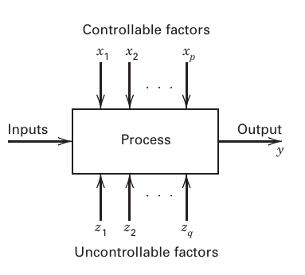
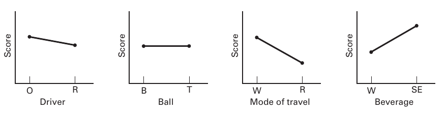
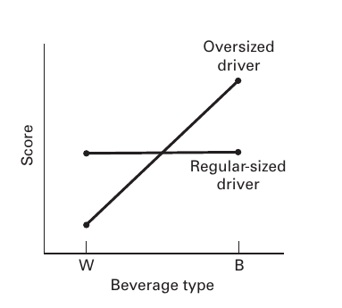
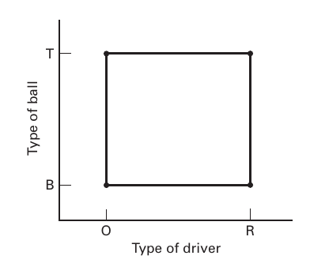
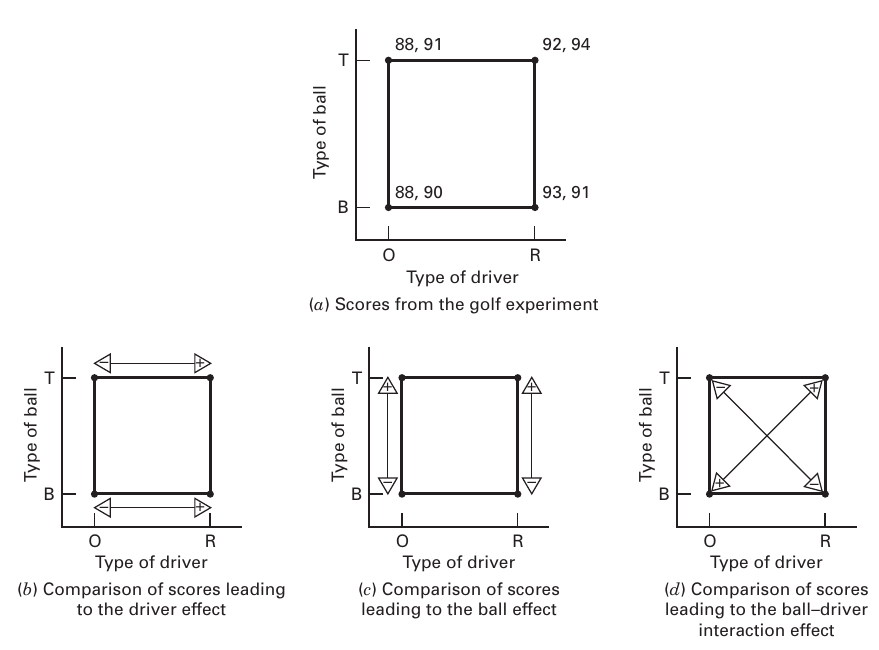
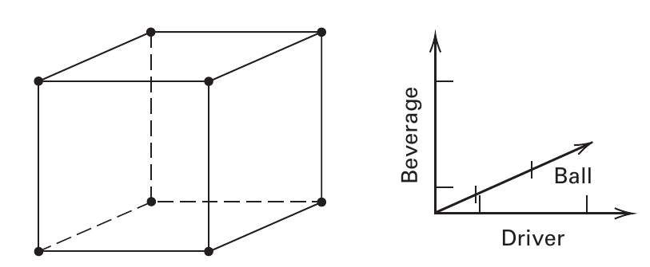
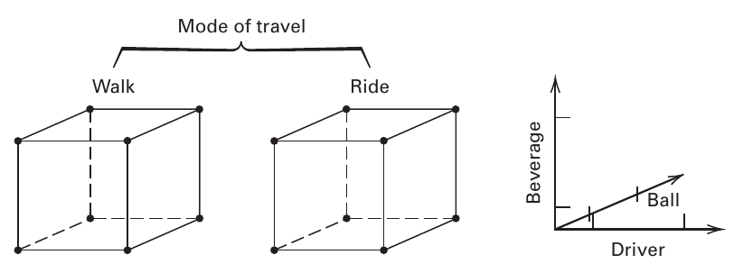
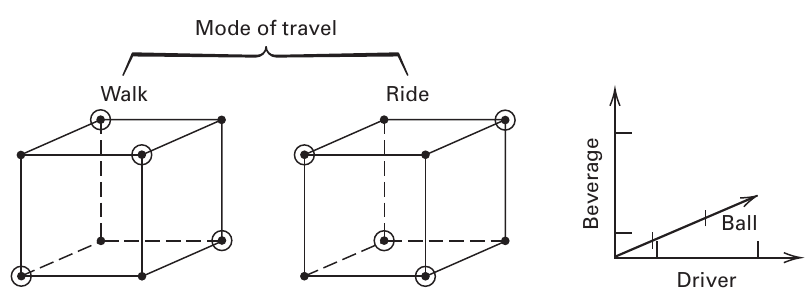

## Strategia eksperymentowania

Obserwacja systemu lub procesu podczas jego działania jest ważną częścią procesu uczenia się i jest integralną częścią zrozumienia, jak działają systemy i procesy. Można próbować zrozumieć proces po prostu go obserwując. Jednak, aby zrozumieć, co dzieje się z procesem, gdy zmienia się pewne czynniki wejściowe, trzeba zrobić coś więcej niż tylko obserwować — tak naprawdę trzeba zmienić te czynniki. Oznacza to, że **aby naprawdę zrozumieć związki przyczynowo-skutkowe w systemie, należy świadomie zmieniać zmienne wejściowe w systemie i obserwować zmiany w danych wyjściowych systemu, które powodują te zmiany w danych wejściowych.** Innymi słowy, musisz przeprowadzić **eksperymenty** w systemie. Obserwacje systemu lub procesu mogą prowadzić do teorii lub hipotez dotyczących tego, co sprawia, że system działa, ale wymagane są eksperymenty typu opisanego powyżej, aby wykazać, że te teorie są poprawne. 

Badacze przeprowadzają eksperymenty w praktycznie wszystkich dziedzinach badań, zwykle w celu odkrycia czegoś na temat określonego procesu lub systemu. Eksperyment możemy zdefiniować jako test lub serię przebiegów, w których dokonuje się celowych zmian zmiennych wejściowych procesu lub systemu, abyśmy mogli zaobserwować i zidentyfikować przyczyny zmian, które można zaobserwować w odpowiedzi wyjściowej. Możemy chcieć określić, które zmienne wejściowe są odpowiedzialne za obserwowane zmiany w odpowiedzi, opracować model odnoszący się do odpowiedzi na ważne zmienne wejściowe i wykorzystać ten model do doskonalenia procesu lub systemu lub podejmowania innych decyzji. 

Planowanie eksperymentu jest dziedziną skupiającą się na planowaniu i przeprowadzaniu eksperymentów oraz analizowaniu uzyskanych danych w celu uzyskania prawidłowych i obiektywnych wniosków. Eksperymentowanie odgrywa ważną rolę w komercjalizacji technologii i działaniach związanych z tworzeniem produktu, które obejmują projektowanie i recepturę nowego produktu, rozwój procesu produkcyjnego i doskonalenie procesu. W wielu przypadkach celem może być opracowanie **odpornego (ang. robust) procesu**, to znaczy procesu, na który wpływ zewnętrznych źródeł zmienności ma minimalny wpływ. Istnieje również wiele zastosowań zaprojektowanych eksperymentów w warunkach niezwiązanych z produkcją lub rozwojem produktu, takich jak marketing, operacje usługowe i operacje biznesowe.

Jako przykład eksperymentu załóżmy, że inżynier metalurgiczny jest zainteresowany badaniem wpływu dwóch różnych procesów hartowania, hartowania w oleju i hartowania w słonej wodzie, na stop aluminium. Tutaj celem **eksperymentatora** (inżyniera) jest określenie, który roztwór hartujący zapewnia maksymalną twardość dla tego konkretnego stopu. Inżynier decyduje o poddaniu pewnej liczby próbek stopu lub próbek testowych każdemu medium hartującemu i zmierzeniu twardości próbek po hartowaniu. Średnia twardość próbek poddanych obróbce w każdym roztworze hartującym zostanie wykorzystana do określenia, który roztwór jest najlepszy. Kiedy rozważamy ten prosty eksperyment, przychodzi nam do głowy kilka ważnych pytań: 

1. Czy te dwa rozwiązania są jedynymi potencjalnie interesującymi mediami hartującymi? 
2. Czy istnieją inne czynniki, które mogą wpływać na twardość, które należy zbadać lub kontrolować w tym eksperymencie (takie jak temperatura środka chłodzącego)? 
3. Ile próbek stopu należy przetestować w każdym roztworze hartowniczym? 
4. W jaki sposób należy przypisać próbki testowe do roztworów hartujących i w jakiej kolejności zbierać dane? 
5. Jaką metodę analizy danych zastosować? 
6. Jaka różnica w średniej obserwowanej twardości między dwoma środkami hartującymi zostanie uznana za ważną? 

Na wszystkie te pytania i być może na wiele innych trzeba będzie odpowiedzieć w sposób zadowalający przed przeprowadzeniem eksperymentu. Eksperymentowanie jest istotną częścią **metody naukowej** (lub **inżynierskiej**). Z pewnością istnieją sytuacje, w których zjawiska naukowe są tak dobrze zrozumiane, że użyteczne wyniki, w tym modele matematyczne, można opracować bezpośrednio, stosując te dobrze zrozumiane zasady. Modele takich zjawisk, które wynikają bezpośrednio z mechanizmu fizycznego, nazywane są zwykle **modelami mechanistycznymi**. Prostym przykładem jest znane równanie przepływu prądu w obwodzie elektrycznym, prawo Ohma, E=IR. Jednak większość problemów w nauce i inżynierii wymaga **obserwacji** systemu w pracy i **eksperymentowania** w celu wyjaśnienia informacji o tym, dlaczego i jak działa. Dobrze zaprojektowane eksperymenty mogą często prowadzić do modelu wydajności systemu; takie eksperymentalnie określone modele nazywane są **modelami empirycznymi**. ***W całej tej książce będziemy prezentować techniki przekształcania wyników zaprojektowanego eksperymentu w empiryczny model badanego systemu.*** Naukowiec lub inżynier może manipulować tymi modelami empirycznymi, tak samo jak modelem mechanistycznym.

**Dobrze zaprojektowany eksperyment jest ważny, ponieważ wyniki i wnioski, jakie można wyciągnąć z eksperymentu, zależą w dużej mierze od sposobu, w jaki dane zostały zebrane.** Aby zilustrować ten punkt, załóżmy, że inżynier metalurgiczny w powyższym eksperymencie użył próbek z jednego wytopu w hartowaniu olejowym i próbek z drugiego wytopu w hartowaniu słoną wodą. Teraz, kiedy porównuje się średnią twardość, inżynier nie jest w stanie powiedzieć, w jakim stopniu zaobserwowana różnica jest wynikiem czynników hartowniczych, a w jakim jest wynikiem nieodłącznych różnic między wytopami. Tak więc metoda zbierania danych niekorzystnie wpłynęła na wnioski, jakie można wyciągnąć z eksperymentu.

Ogólnie rzecz biorąc, eksperymenty służą do badania działania procesów i systemów. Proces lub system można przedstawić za pomocą modelu pokazanego na ***rysunku 1.1***. Zwykle możemy zwizualizować proces jako kombinację operacji, maszyn, metod, ludzi i innych zasobów, która przekształca pewne dane wejściowe w dane wyjściowe, które mają jedną lub więcej obserwowalnych zmiennych odpowiedzi. Niektóre zmienne wejściowe analiza $x_1$, $x_2$, $\dots$, $x_p$ są kontrolowalne, podczas gdy inne zmienne $z_1$, $z_2$, $\dots$, $z_q$ są niekontrolowalne (chociaż mogą być sterowalne dla celów testu). 

<figure>
    
    <figcaption><strong>Rysunek 1. </strong>Ogólny model procesu lub systemu.</figcaption>
</figure>

Cele eksperymentu mogą obejmować: 

1. Określenie, które zmienne mają największy wpływ na odpowiedź $y$ 
2. Określenie, jak ustawić wpływowe $x$, tak aby $y$ było prawie zawsze blisko pożądanej wartości nominalnej 
3. Określenie, jak ustawić wpływowe $x$ tak, żeby zmienność w $y$ była mała 
4. Określenie, jak ustawić wpływowe $x$, aby efekty zmiennych niekontrolowanych $z_1$, $z_2$, $\dots$, $z_q$ były zminimalizowane. 

Jak widać z powyższej dyskusji, eksperymenty często obejmują kilka czynników. Zwykle celem eksperymentatora jest określenie wpływu tych czynników na odpowiedź wyjściową systemu. Ogólne podejście do planowania i przeprowadzania eksperymentu nazywa się **strategią eksperymentowania**. Eksperymentator może zastosować kilka strategii. Niektóre z nich zilustrujemy bardzo prostym przykładem.

### Przykład

Bardzo lubię grać w golfa. Niestety nie lubię ćwiczyć, więc zawsze szukam prostszego sposobu na polepszenie wyniku. Niektóre z czynników, które moim zdaniem mogą być ważne lub które mogą mieć wpływ na mój wynik w golfa, to: 

1. Wielkość główki kija rozpoczynającego rozgrywkę (ang. driver) (oversize lub normalny rozmiar) 
2. Rodzaj używanej piłki (balata lub trzyczęściowa)
3. Chodzenie i noszenie kijów golfowych lub jazda wózkiem golfowym 
4. Picie wody lub picie „czegoś innego” podczas gry 
5. Gra rano lub gra po południu 
6. Gra, gdy jest chłodno lub gra, gdy jest gorąco 
7. Rodzaj noszonych kolców w butach golfowych (metalowe lub miękkie) 
8. Gra w wietrzny dzień lub gra w bezwietrzny dzień. 

Oczywiście można wziąć pod uwagę wiele innych czynników, ale załóżmy, że to te, które nas interesują. Ponadto, opierając się na długim doświadczeniu z grą, zdecydowałem, że czynniki od 5 do 8 można zignorować; to znaczy, te czynniki nie są ważne, ponieważ ich wpływ jest tak mały, że nie mają żadnej wartości praktycznej. Inżynierowie, naukowcy i analitycy biznesowi często muszą podejmować tego typu decyzje dotyczące niektórych czynników, które biorą pod uwagę w rzeczywistych eksperymentach.

Zastanówmy się teraz, w jaki sposób czynniki od 1 do 4 można przetestować eksperymentalnie, aby określić ich wpływ na mój wynik w golfie. Załóżmy, że w trakcie eksperymentu można rozegrać maksymalnie osiem rund golfa. Jednym ze sposobów byłoby wybranie dowolnej kombinacji tych czynników, przetestowanie ich i zobaczenie, co się stanie. Załóżmy na przykład, że zostanie wybrana kombinacja: główka oversize, piłka balata, wózek golfowy i woda, a wynik końcowy to 87. Jednak podczas rundy zauważyłem kilka niecelnych uderzeń kijem z dużą główką, w wyniku czego decyduję się rozegrać kolejną rundę z normalnym kijem, utrzymując pozostałe czynniki na tych samych poziomach, co poprzednio. Podejście to można by kontynuować prawie w nieskończoność, zmieniając poziomy jednego lub dwóch (a może kilku) czynników dla następnego testu, w oparciu o wynik bieżącego testu. Ta strategia eksperymentowania, którą nazywamy **podejściem „najlepszego odgadnięcia”**, jest często stosowana w praktyce przez inżynierów i naukowców. Często działa to dość dobrze, ponieważ eksperymentatorzy często mają dużą wiedzę techniczną lub teoretyczną na temat badanego systemu, a także znaczne doświadczenie praktyczne. Podejście oparte na najlepszym odgadnięciu ma co najmniej dwie wady. Po pierwsze, załóżmy, że początkowe najlepsze odgadnięcie nie daje pożądanych rezultatów. Teraz eksperymentator musi ponownie odgadnąć prawidłową kombinację poziomów czynników. Mogłoby to trwać bardzo długo, bez żadnej gwarancji powodzenia. Po drugie, załóżmy, że początkowe najlepsze odgadnięcie daje akceptowalny wynik. Teraz eksperymentator ma ochotę przerwać testowanie, chociaż nie ma gwarancji, że znaleziono najlepsze rozwiązanie. 

Inną strategią eksperymentowania, szeroko stosowaną w praktyce, jest podejście **"jeden czynnik po drugim" (ang. „one-factor-at-a-time” (OFAT))**. Metoda OFAT polega na wybraniu punktu początkowego lub podstawowego zestawu poziomów dla każdego czynnika, a następnie sukcesywnej zmianie każdego czynnika w jego zakresie z pozostałymi czynnikami utrzymywanymi na poziomie podstawowym. Po przeprowadzeniu wszystkich testów zwykle konstruuje się serię wykresów pokazujących, w jaki sposób na zmienną odpowiedzi wpływa zmiana każdego czynnika przy zachowaniu wszystkich innych czynników na stałym poziomie. 

<figure>
    
    <figcatpion align="center"><strong>Rysunek 2.</strong> Wyniki strategii OFAT dla eksperymentu gry w golfa.</figcatpion>
</figure>

Rysunek 2 przedstawia wykresy dla eksperymentu golfowego, z uwzględnieniem rozmiaru główki kija, piłki, sposobu poruszania się oraz rodzaju spożywanych napojów. Interpretacja tego wykresu jest prosta; na przykład, ponieważ nachylenie krzywej trybu poruszania się jest malejące, możemy dojść do wniosku, że lepszy wynik uzyskuje się jeżdżąc (R), a nie chodząc (W). Korzystając z tych wykresów uwzględniających jeden czynnik na raz, wybralibyśmy optymalną kombinację: kij ze standardową główką, poruszanie się jeżdżąc i picie wody. Rodzaj piłki golfowej wydaje się nieistotny. 

Główną wadą strategii OFAT jest to, że nie uwzględnia możliwych interakcji pomiędzy czynnikami. Rysunek 3 przedstawia interakcję między typem główki kija, a spożywanymi napojami w eksperymencie golfowym. 

<figure>
    
    <figcaption><strong>Rysunek 3. </strong>Interakcja pomiędzy typem główki kija, a spożywanymi napojami w eksperymencie golfowym.</figcaption>
</figure>

Zauważ, że jeśli użyję kija ze standardową główką, to rodzaj spożywanego napoju praktycznie nie ma wpływu na wynik, natomiast jeśli użyję kija z dużą główką, to uzyskuję znacznie lepsze wyniki pijąc wodę zamiast piwa. Interakcje między czynnikami są bardzo częste i jeśli wystąpią to strategia „jeden czynnik po drugim” zwykle da słabe wyniki. Wiele osób tego nie dostrzega, w związku z czym eksperymenty OFAT są często przeprowadzane w praktyce. **Eksperymenty z jednym czynnikiem na raz są zawsze mniej wydajne niż inne metody oparte na statystycznym podejściu do projektowania**. 

Właściwym podejściem do radzenia sobie z kilkoma czynnikami jest przeprowadzenie **eksperymentu czynnikowego**. Jest to strategia eksperymentalna, w której czynniki są zmieniane razem, a nie pojedynczo. 

Aby zilustrować sposób przeprowadzania eksperymentu czynnikowego, rozważmy eksperyment golfowy i załóżmy, że interesują nas tylko dwa czynniki, typ główki kija i rodzaj piłki. Rysunek 4 przedstawia dwuczynnikowy eksperyment czynnikowy służący do badania łącznego wpływu tych dwóch czynników na mój wynik golfowy. 

<figure style="align: center;">
    
    <figcaption><strong>Rysunek 4.</strong> Dwuczynnikowy eksperyment czynnikowy badający wpływ użytej główki kija i typu piłki.</figcaption>
</figure>

Należy zauważyć, że w tym eksperymencie czynnikowym oba czynniki występują na dwóch poziomach i że w projekcie wykorzystano wszystkie możliwe kombinacje tych dwóch czynników na różnych poziomach. Geometrycznie cztery przebiegi tworzą rogi kwadratu. Ten szczególny typ eksperymentu czynnikowego nazywany jest planem czynnikowym $2^2$ (dwa czynniki, każdy na dwóch poziomach). Zamierzam rozegrać osiem rund golfa w celu zbadania tych czynników, zatem rozsądnym planem byłoby rozegranie dwóch rund golfa przy każdej kombinacji poziomów czynników pokazanych na Rysunku 4. Ten schemat eksperymentu umożliwiłby eksperymentatorowi zbadanie efektów każdego czynnika  i określenie, czy czynniki oddziałują na siebie.  Rysunek 5a przedstawia wyniki przeprowadzenia eksperymentu czynnikowego z rysunku 4. 

<figure>
    
    <figcaption><strong>Rysunek 5.</strong> Wyniki punktowe w eksperymencie golfowym z rysunku 4 oraz obliczenia efektów czynników.</figcaption>
</figure>

Wyniki z każdej rundy golfa rozgrywanej w czterech kombinacjach testowych są pokazane w rogach kwadratu. Zwróć uwagę, że są cztery rundy golfa, które dostarczają informacji na temat korzystania z kija ze standardową główką i cztery rundy, które dostarczają informacji na temat korzystania z kija z większą główką. Znajdując średnią różnicę w wynikach po prawej i lewej stronie kwadratu (jak na rysunku 5b), uzyskujemy miarę efektu zmiany główki z dużej na standardową: 

Efekt główki kija = $\frac{92 + 94 + 93 + 91}{4} - \frac{88+91+88+90}{4} = 3.25$. 

Oznacza to, że przejście z główki ponadwymiarowej na standardową zwiększa wynik średnio o 3.25 uderzeń na rundę. Podobnie, średnia różnica między czterema wynikami na górze kwadratu i czterema wynikami na dole jest miarą wpływu rodzaju użytej piłki (patrz rysunek 5c):

Efekt piłki = $\frac{88+91+92+94}{4} - \frac{88+90+93+91}{4} = 0.75$.

Wreszcie, miarę efektu interakcji między typem piłki a typem główki kija można uzyskać, odejmując średnie wyniki na przekątnej od lewej do prawej w kwadracie od średnich wyników na przekątnej od prawej do lewej (zob. 5d), co w wyniku daje:

Efekt interakcji piłka-główka kija = $\frac{92+94+88+90}{4} - \frac{88+91+93+91}{4} = 0.25$.

Wyniki tego eksperymentu czynnikowego wskazują, że efekt główki kija jest większy niż efekt piłki czy efekt interakcji. Można wykorzystać testy statystyczne do określenia, czy którykolwiek z tych efektów różni się od zera. W rzeczywistości okazuje się, że istnieją dość mocne dowody statystyczne na to, że efekt rozmiaru główki różni się od zera, a dwa pozostałe efekty nie. Dlatego ten eksperyment wskazuje, że powinienem zawsze używać kija o powiększonej główce. 

Jedna bardzo ważna cecha eksperymentu czynnikowego jest widoczna na tym prostym przykładzie; mianowicie eksperymenty czynnikowe najbardziej efektywnie wykorzystują dane eksperymentalne. Zauważ, że ten eksperyment obejmował osiem obserwacji, a wszystkie osiem obserwacji wykorzystano do obliczenia efektów główki, piłki i interakcji. Żadna inna strategia eksperymentowania nie pozwala na tak efektywne wykorzystanie danych. Jest to ważna i użyteczna cecha eksperymentów czynnikowych. 

Koncepcję eksperymentu czynnikowego możemy rozszerzyć na trzy czynniki. Załóżmy, że chcę zbadać wpływ rodzaju główki, rodzaju piłki i rodzaju spożywanego napoju na mój wynik w golfie. Zakładając, że wszystkie trzy czynniki mają dwa poziomy, można utworzyć układ czynnikowy, jak pokazano na rysunku 6. 

<figure>
    
    <figcapture><strong>Rysunek 6. </strong>Trójczynnikowy plan eksperymentu uwzględniający rodzaj główki kija, typ piłki oraz rodzaj spożywanego napoju.</figcapture>
</figure>

Zauważ, że istnieje osiem kombinacji testów tych trzech czynników na dwóch poziomach każdego z nich, i że te osiem prób można przedstawić geometrycznie jako narożniki sześcianu. To jest przykład planu  czynnikowego $2^3$. Ponieważ chcę rozegrać tylko osiem rund golfa, ten eksperyment wymagałby rozegrania jednej rundy w każdej kombinacji czynników reprezentowanych przez osiem rogów sześcianu na rysunku 6. Jeśli jednak porównamy to z dwuczynnikowym planem na rysunku 4, $\mathbf{2^3}$**-czynnikowy plan** dostarczy tych samych informacji o efektach czynników. Na przykład w obu planach są cztery testy, które dostarczają informacji o zwykłej główce i cztery testy, które dostarczają informacji o powiększonej główce kija przy założeniu, że każdy przebieg w planie dwuczynnikowym na rysunku 4 jest powtarzany dwukrotnie. 

Rysunek 7 ilustruje, w jaki sposób wszystkie cztery czynniki — typ główki, piłka, napój i sposób przemieszczania się (chodzenie lub jazda) — można zbadać w $\mathbf{2^4}$**-czynnikowym planie**. Jak w każdym układzie czynnikowym, wykorzystywane są wszystkie możliwe kombinacje poziomów czynników. Ponieważ wszystkie cztery czynniki są na dwóch poziomach, ten układ eksperymentalny nadal można przedstawić geometrycznie jako sześcian (właściwie hipersześcian). 

<figure>
     
    <figcaption><strong>Rysunek 7.</strong>  Czteroczynnikowy plan eksperymentu uwzględniający typ główki kija, typ piłki, rodzaj spożywanego napoju oraz sposób przemieszczania się.</figcaption>
</figure>

Ogólnie rzecz biorąc, jeśli istnieje $k$ czynników, każdy na dwóch poziomach, układ k-czynnikowy wymaga $2^k$ przebiegów. Na przykład eksperyment z rysunku 7 wymaga 16 przebiegów. Oczywiście, wraz ze wzrostem liczby czynników będących przedmiotem zainteresowania, liczba wymaganych przebiegów gwałtownie wzrasta; na przykład eksperyment 10-czynnikowy ze wszystkimi czynnikami na dwóch poziomach wymagałby 1024 przebiegów. Szybko staje się to niewykonalne z punktu widzenia czasu i zasobów. W eksperymencie golfowym mogę rozegrać tylko osiem rund golfa, więc nawet eksperyment z rysunku 7 jest zbyt duży. 

Na szczęście, jeśli istnieje cztery-pięć lub więcej czynników, zwykle nie ma potrzeby przeprowadzania wszystkich możliwych kombinacji poziomów czynników. **Frakcyjny eksperyment czynnikowy** jest odmianą podstawowego planu czynnikowego, w którym używany jest tylko podzbiór przebiegów. Rysunek 8 przedstawia plan frakcyjny czteroczynnikowej wersji eksperymentu golfowego. Ten plan wymaga tylko 8 przebiegów zamiast oryginalnych 16. Jeśli mogę rozegrać tylko osiem rund golfa, jest to doskonały plan do zbadania wszystkich czterech czynników, który dostarczy wiarygodnych informacji o głównych skutkach czterech czynników, a także trochę informacji o tym, jak te czynniki oddziałują na siebie. Ułamkowe układy czynnikowe są szeroko stosowane w badaniach i rozwoju przemysłowym oraz w doskonaleniu procesów. 

<figure>
     
    <figcaption><strong>Rysunek 8.</strong>  Frakcyjny plan czteroczynnikowy uwzględniający typ główki kija, typ piłki, rodzaj spożywanego napoju oraz sposób przemieszczania się.</figcaption>
</figure>

## Wytyczne dotyczące planowania eksperymentów

Aby zastosować podejście statystyczne w projektowaniu i analizie eksperymentu, konieczne jest, aby wszyscy zaangażowani w eksperyment mieli z góry jasne pojęcie o tym, co dokładnie ma być badane, w jaki sposób dane mają być zbierane, a przynajmniej jakościowe zrozumienie, w jaki sposób te dane mają być analizowane. 

### 1. Zdefiniowanie problemu. 

Może się to wydawać dość oczywistym punktem, ale w praktyce często nie jest łatwo uświadomić sobie, że istnieje problem wymagający eksperymentów, ani też sformułować jasnego i powszechnie akceptowanego stwierdzenia tego problemu. Konieczne jest rozwinięcie wszystkich pomysłów dotyczących celów eksperymentu. Zwykle ważne jest, aby zabiegać o wkład wszystkich zainteresowanych stron: inżynierów, kontrolerów jakości, produkcji, marketingu, zarządzania, klientów i personelu operacyjnego. Z tego powodu zalecane jest podejście zespołowe do projektowania eksperymentów. Zwykle pomocne jest przygotowanie listy konkretnych problemów lub pytań, które mają zostać rozwiązane w ramach eksperymentu. Jasne sformułowanie problemu często znacząco przyczynia się do lepszego zrozumienia badanego zjawiska i ostatecznego rozwiązania problemu. Ważne jest również, aby pamiętać o ogólnych celach eksperymentu. 

Istnieje kilka ogólnych powodów przeprowadzania eksperymentów, a każdy typ eksperymentu generuje własną listę konkretnych pytań, które należy rozwiązać. Niektóre (ale bynajmniej nie wszystkie) powody przeprowadzania eksperymentów obejmują:

1. **Badanie przesiewowe lub charakterystyka czynników.** 

   Gdy system lub proces jest nowy, zwykle ważne jest, aby dowiedzieć się, które czynniki mają największy wpływ na interesujące nas zmienne wyjściowe. Eksperymenty przesiewowe są niezwykle ważne podczas pracy z nowymi systemami lub technologiami, aby cenne zasoby nie zostały zmarnowane przy użyciu metod najlepszego zgadywania i OFAT.

2. **Optymalizacja.** 

   Po scharakteryzowaniu systemu i uzyskaniu wystarczającej pewności, że zidentyfikowano istotne czynniki, następnym celem jest zwykle optymalizacja, czyli znalezienie ustawień lub poziomów ważnych czynników, które skutkują pożądanymi wartościami odpowiedzi. Na przykład, jeśli eksperyment przesiewowy dotyczący procesu chemicznego wykaże, że czas i temperatura są dwoma najważniejszymi czynnikami, celem eksperymentu optymalizacyjnego może być znalezienie poziomów czasu i temperatury, które maksymalizują wydajność lub być może maksymalizują wydajność przy zachowaniu niektórych właściwości produktu, które są krytyczne dla klienta w ramach specyfikacji. 

3. **Potwierdzenie.** 

   W eksperymencie potwierdzającym eksperymentator zwykle próbuje zweryfikować, czy system działa lub zachowuje się w sposób zgodny z jakąś teorią lub przeszłymi doświadczeniami. Na przykład, jeśli teoria lub doświadczenie wskazuje, że określony nowy materiał jest odpowiednikiem tego, który jest obecnie używany, a nowy materiał jest pożądany (być może tańszy lub w jakiś sposób łatwiejszy w obróbce), wówczas należy przeprowadzić eksperyment potwierdzający, aby zweryfikować, czy zastąpienie nowego materiału nie powoduje zmiany właściwości produktu, które mają wpływ na jego zastosowanie.
   Przeniesienie nowego procesu produkcyjnego do produkcji na pełną skalę w oparciu o wyniki uzyskane podczas eksperymentów w zakładzie pilotażowym lub miejscu rozwoju to kolejna sytuacja, która często prowadzi do eksperymentów potwierdzających — to znaczy, czy te same czynniki i ustawienia, które zostały określone podczas prac rozwojowych, są odpowiednie dla procesu na pełną skalę

4. **Odkrycie.** 

   W eksperymentach odkrywczych eksperymentatorzy zwykle próbują określić, co się stanie, gdy zbadamy nowe materiały, nowe czynniki lub nowe zakresy czynników. W przemyśle farmaceutycznym naukowcy nieustannie przeprowadzają odkrywcze eksperymenty, aby znaleźć nowe materiały lub kombinacje materiałów, które będą skuteczne w leczeniu chorób.

5. **Odporność**. 

   Eksperymenty te często dotyczą pytań, takich jak: w jakich warunkach zmienne odpowiedzi ulegają poważnej degradacji? Odmianą tego rodzaju eksperymentów jest określenie, w jaki sposób możemy ustawić czynniki w systemie, które możemy kontrolować, aby zminimalizować zmienność wynikającą z czynników, których nie możemy zbyt dobrze kontrolować. 

Ważnym aspektem formułowania problemu jest uświadomienie sobie, że jest mało prawdopodobne, aby jeden duży kompleksowy eksperyment dał satysfakcjonującą odpowiedź na kluczowe pytania. Lepszą strategią jest sekwencyjne podejście wykorzystujące serię mniejszych eksperymentów, z których każdy ma określony cel.

### 2. Wybór zmiennej odpowiedzi. 

Wybierając zmienną odpowiedzi, eksperymentator powinien mieć pewność, że ta zmienna rzeczywiście dostarcza użytecznych informacji o badanym procesie. Najczęściej zmienną odpowiedzi będzie średnia lub odchylenie standardowe (lub oba) mierzonej charakterystyki. Wiele zmiennych odpowiedzi nie jest niczym niezwykłym. Prze przeprowadzeniem eksperymentu eksperymentatorzy muszą zdecydować, w jaki sposób mierzona będzie każda odpowiedź, i zająć się takimi kwestiami, jak sposób kalibracji dowolnego systemu pomiarowego i sposób utrzymania tej kalibracji podczas eksperymentu. 

### 3. Wybór czynników, ich poziomów i zakresów.

Rozważając czynniki, które mogą wpływać na wydajność procesu lub systemu, eksperymentator zwykle odkrywa, że czynniki te można sklasyfikować jako potencjalne czynniki projektowe lub czynniki uciążliwe. 

Potencjalne czynniki projektowe to te czynniki, które eksperymentator może chcieć zmienić w eksperymencie. Często okazuje się, że istnieje wiele potencjalnych czynników projektowych i pomocna jest ich dalsza klasyfikacja. Niektóre przydatne klasyfikacje to czynniki projektowe, czynniki utrzymywane jako stałe i czynniki, które mogą się zmieniać. Czynniki projektowe to czynniki faktycznie wybrane do badania w eksperymencie. Czynniki utrzymywane jako stałeto zmienne, które mogą wywierać pewien wpływ na odpowiedź, ale dla celów niniejszego eksperymentu czynniki te nie są przedmiotem zainteresowania, więc będą utrzymywane na określonym poziomie. Na przykład w eksperymencie wytrawiania w przemyśle półprzewodnikowym może wystąpić efekt, który jest unikalny dla konkretnego narzędzia do wytrawiania użytego w eksperymencie. Jednak czynnik ten byłby bardzo trudny do zróżnicowania w eksperymencie, więc eksperymentator może zdecydować się na wykonanie wszystkich przebiegów eksperymentalnych na jednym konkretnym (idealnie „typowym”) wytrawiaczu.

Często zakładamy, że wpływ czynników utrzymywanych na stałym poziomie i czynników dopuszczanych do zmiany jest stosunkowo niewielki. Czynniki uciążliwe, z drugiej strony, mogą mieć duży wpływ, który należy uwzględnić, ale możemy nie być nim zainteresowani w kontekście eksperymentu. Czynniki uciążliwe są często klasyfikowane jako czynniki podlegające kontroli, niekontrolowane lub czynniki hałasu. Kontrolowany czynnik uciążliwy to taki, którego poziomy mogą być ustalane przez eksperymentatora. Na przykład eksperymentator może wybrać różne partie surowca lub różne dni tygodnia podczas przeprowadzania eksperymentu. Jeśli uciążliwy czynnik jest niekontrolowany w eksperymencie, ale można go zmierzyć, często można zastosować procedurę analizy zwaną analizą kowariancji, aby zrekompensować jego wpływ. Na przykład wilgotność względna w środowisku procesu może wpływać na wydajność procesu, a jeśli nie można kontrolować wilgotności, prawdopodobnie można ją zmierzyć i traktować jako współzmienną. Kiedy czynnik, który zmienia się w sposób naturalny i niekontrolowany w procesie, może być kontrolowany dla celów eksperymentu, często nazywamy go czynnikiem szumowym. W takich sytuacjach naszym celem jest zwykle znalezienie takich ustawień kontrolowanych czynników projektowych, które minimalizują zmienność przenoszoną przez czynniki szumu. 

Gdy eksperymentator wybierze czynniki projektowe, musi wybrać zakresy, w których te czynniki będą się zmieniać, oraz konkretne poziomy, na których zostaną wykonane przebiegi eksperymentu. Należy również przemyśleć, w jaki sposób te czynniki mają być kontrolowane do pożądanych wartości i jak mają być mierzone. W planie czynnikowym obszar zainteresowania powinien być stosunkowo duży - to znaczy zakres, w którym czynniki są zróżnicowane, powinien być szeroki. Gdy dowiemy się więcej o tym, które zmienne są ważne i które poziomy dają najlepsze wyniki, obszar zainteresowania w kolejnych eksperymentach zwykle będzie się zawężał. 

### 4. Wybór planu eksperymentu. 

Jeśli uprzednie czynności planowania przed-eksperymentalnego są wykonane prawidłowo, ten krok jest stosunkowo łatwy. Wybór projektu obejmuje rozważenie wielkości próby (liczby powtórzeń), wybór odpowiedniej kolejności serii badań eksperymentalnych oraz określenie, czy w grę wchodzą ograniczenia randomizacji eksperymentu. Istnieją również pakiety oprogramowania statystycznego, które obsługują tę fazę projektowania eksperymentów. Eksperymentator może wprowadzić informacje o liczbie czynników, poziomach i zakresach, a te programy albo przedstawią wybór planów do rozważenia, albo zarekomendują konkretny plan. Większość pakietów oprogramowania zawiera również pewne informacje diagnostyczne dotyczące działania każdego planu. Wybór planu obejmuje również przemyślenie i wybranie wstępnego modelu empirycznego do opisania wyników, czyli ilościowego związku pomiędzy odpowiedzią a ważnymi czynnikami projektowymi. 

### 5. Przeprowadzenie eksperymentu. 

Podczas przeprowadzania eksperymentu ważne jest uważne monitorowanie procesu, aby upewnić się, że wszystko odbywa się zgodnie z planem. Błędy w procedurze eksperymentalnej na tym etapie zwykle niszczą ważność eksperymentu. Jednym z najczęstszych błędów, z jakimi się spotkałem, było to, że osoby przeprowadzające eksperyment nie ustawiały zmiennych na odpowiednich poziomach w niektórych seriach. Przed każdym przebiegiem należy wyznaczyć kogoś, kto sprawdzi ustawienia czynników. Planowanie z góry, aby zapobiec takim błędom, ma kluczowe znaczenie dla sukcesu. Łatwo jest nie docenić logistycznych i planistycznych aspektów prowadzenia zaprojektowanego eksperymentu w złożonym środowisku produkcyjnym lub badawczo-rozwojowym. Coleman i Montgomery (1993) sugerują, że przed przeprowadzeniem eksperymentu często pomocne jest kilka serii próbnych lub pilotażowych. Przebiegi te dostarczają informacji na temat spójności materiału doświadczalnego, sprawdzenia systemu pomiarowego, przybliżonego pojęcia błędu eksperymentalnego oraz szansy na przećwiczenie ogólnej techniki eksperymentalnej. Daje to również możliwość ponownego rozważenia decyzji podjętych w krokach 1–4, jeśli to konieczne.

### 6. Analiza statystyczna danych. 

Do analizy danych należy stosować metody statystyczne, tak aby wyniki i wnioski miały charakter obiektywny, a nie subiektywny. Jeśli eksperyment został zaprojektowany prawidłowo i przeprowadzony zgodnie z planem, wymagane metody statystyczne nie są skomplikowane. Techniki statystyczne w połączeniu z dobrą znajomością inżynierii lub procesów oraz zdrowym rozsądkiem zwykle prowadzą do rozsądnych wniosków.

### 7. Wnioski i rekomendacje. 

Po przeanalizowaniu danych eksperymentator musi wyciągnąć praktyczne wnioski na temat wyników i zalecić sposób działania. Na tym etapie często przydatne są metody graficzne, szczególnie przy prezentowaniu wyników innym. Należy również przeprowadzić kolejne serie i testy potwierdzające, aby zweryfikować wnioski z eksperymentu. W całym tym procesie ważne jest, aby pamiętać, że eksperymentowanie jest ważną częścią procesu uczenia się, w którym wstępnie formułujemy hipotezy dotyczące systemu, przeprowadzamy eksperymenty w celu zbadania tych hipotez i na podstawie wyników formułujemy nowe hipotezy, i tak dalej. Sugeruje to, że eksperymentowanie jest iteracyjne. Zwykle poważnym błędem jest projektowanie jednego, dużego, kompleksowego eksperymentu na początku badania. Udany eksperyment wymaga znajomości ważnych czynników, zakresów, w których te czynniki powinny się zmieniać, odpowiedniej liczby poziomów do wykorzystania oraz właściwych jednostek miary dla tych zmiennych. Generalnie nie znamy do końca odpowiedzi na te pytania, ale poznajemy je na bieżąco. W miarę postępu programu eksperymentalnego często odrzucamy niektóre zmienne wejściowe, dodajemy inne, zmieniamy region eksploracji niektórych czynników lub dodajemy nowe zmienne odpowiedzi. Wreszcie, ważne jest, aby wszystkie eksperymenty były eksperymentami zaplanowanymi. Ważną kwestią jest to, czy są one dobrze zaplanowane, czy nie. Dobre planowanie przed-eksperymentalne zwykle prowadzi do dobrego, udanego eksperymentu. Brak takiego planowania zwykle prowadzi do straty czasu, pieniędzy i innych zasobów, a często do słabych lub rozczarowujących wyników.

## Zadanie 

Załóżmy, że chcesz zbadać czynniki, które potencjalnie wpływają na gotowanie ryżu.
(a) Czego użył(a)byś jako zmiennej odpowiedzi w tym eksperymencie? Jak zmierzył(a)byś tę odpowiedź?
(b) Wymień wszystkie potencjalne źródła zmienności, które mogą mieć wpływ na odpowiedź.
(c) Wykonaj pierwsze trzy kroki wytycznych dotyczących projektowania eksperymentów w poprzedniej części.

## Źródło

Powyższy tekst został przygotowany na podstawie rozdziału 1, sekcja 1.1 i 1.4, podręcznika: Montgomery, D. C. (2012). Design and Analysis of Experiments. Hoboken, NJ: Jon Wiley & Sons. *Inc.* (2012).

