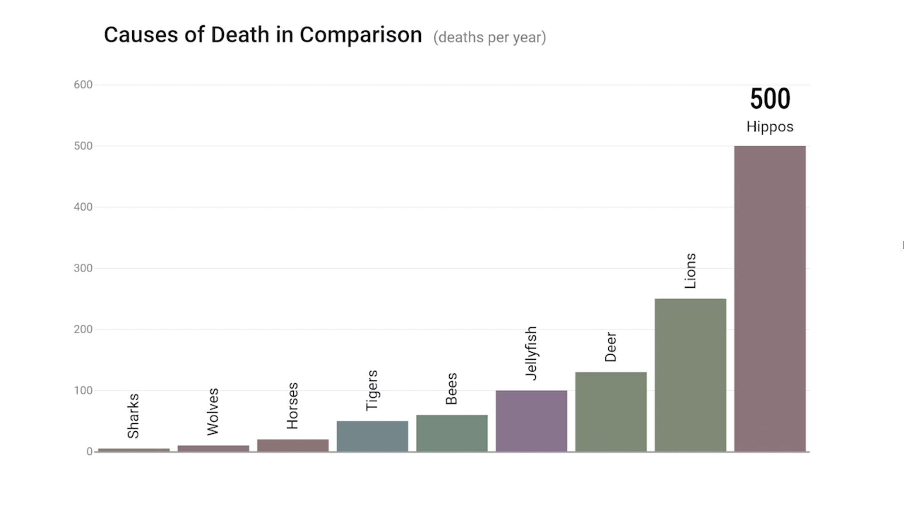

# Wykład 2 - Wizualizacje

[Slajdy z wykładu](wyklad2.pdf)

[Notebook z wykresami w matplotlib, seaborn i plotly](Wyklad2.ipynb)

## Materiały uzupełniające

### Animacje

Animacje pomagają wyeksponować zmiany i zilustrować postęp. Dla przykładu, podlinkowana poniżej animacja wybranych przyczyn śmierci, pozwala uchwycić wzajemną skalę różnych przyczyn, a mordercze szczęki rekinów nagle stają się pomijalne. 

Źródło: https://www.redditmedia.com/r/dataisbeautiful/comments/e1mcb2/oc_selected_causes_of_death_in_comparison_with

### Pięć cech wspaniałych wizualizacji wg Alberto Cairo 

#### Prawdomówność (Truthful)

1. Cairo, A. (2015). Graphics lies, misleading visuals. In *New challenges for data design* (pp. 103-116). Springer, London. https://faculty.ucmerced.edu/jvevea/classes/Spark/readings/Cairo2015_Chapter_GraphicsLiesMisleadingVisuals.pdf 
2. Wizualizacje, które nie mają sensu https://viz.wtf
3. Grupa "Analityk płakał jak raportował" https://www.facebook.com/analitykplakal/ 

#### Funkcjonalność (Functional)

4. Wykresy Unplugged https://betaandbit.github.io/WykresyUnplugged/ 

#### Piękno (Beautiful)

5. Seria "Data Looks Better Naked" https://www.darkhorseanalytics.com/remove-to-improve 

6. Bateman, S., Mandryk, R. L., Gutwin, C., Genest, A., McDine, D., & Brooks, C. (2010, April). [Useful junk? The effects of visual embellishment on comprehension and memorability of charts.](https://www.researchgate.net/publication/221517808_Useful_Junk_The_effects_of_visual_embellishment_on_comprehension_and_memorability_of_charts ) In *Proceedings of the SIGCHI conference on human factors in computing systems* (pp. 2573-2582).  

#### Wnikliwość (Insightful)

#### Olśnienie (Englightening)

### Biblioteki

1. Matplotlib & Pyplot
   * https://matplotlib.org/stable/tutorials/introductory/pyplot.html 
   * Hunter, J., & Droettboom, M. (2012). [matplotlib](http://www.aosabook.org/en/matplotlib.html) in A. Brown (Ed.), *The Architecture of Open Source Applications, Volume II: Structure, Scale, and a Few More Fearless Hacks* (Vol. 2) 
2. Plotly
   * https://plotly.com/python/ 
3. Seaborn
   * https://seaborn.pydata.org

